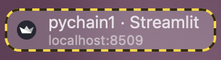
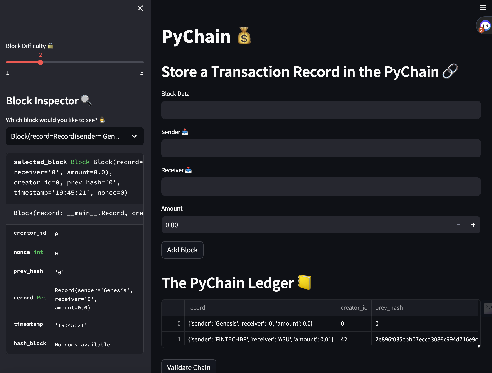
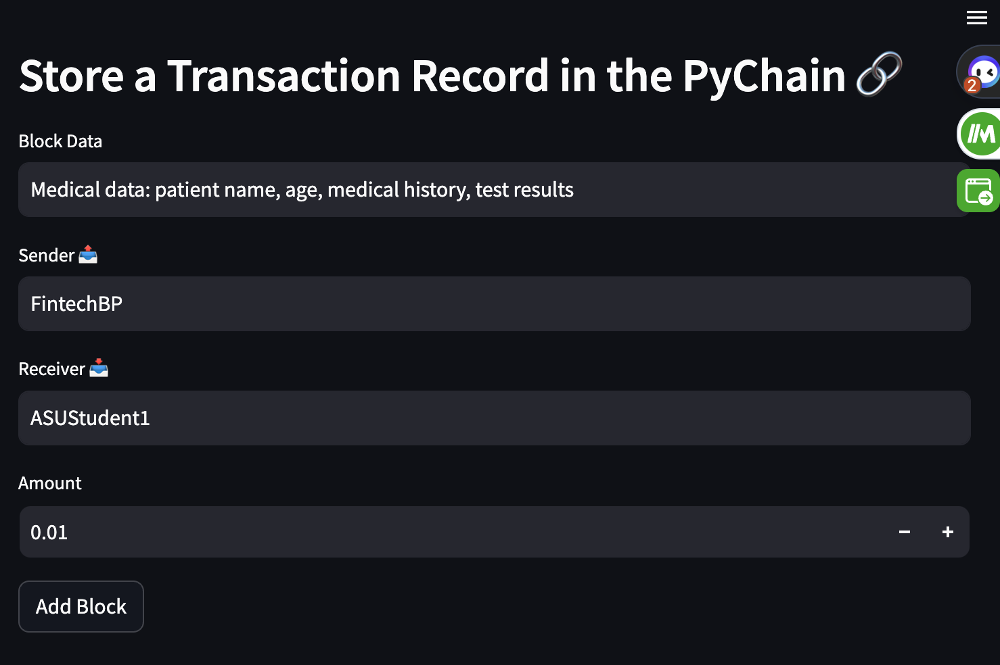
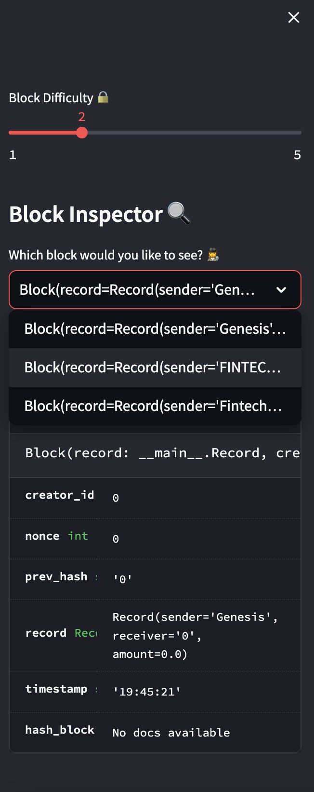
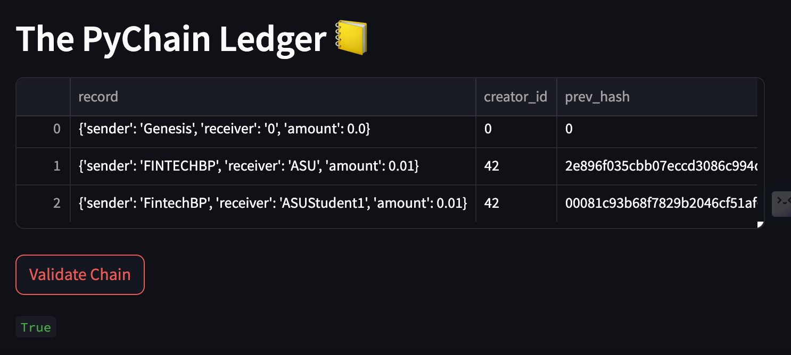

# PyChain Ledger: The Revolution in Decentralized Transactions! 🚀💰

Welcome aboard, adventurers! The era of decentralized finance is upon us, and as pioneers, we are in for an exciting quest. By modifying a pre-existing Python script, we are going to create a groundbreaking, blockchain-based ledger that can record and validate financial transactions with the utmost integrity. 

## The Quest 🗺️

Our journey will be marked by four significant milestones:

### Milestone 1: Crafting the Record Blueprint 📐

In our quest, our first task is to design a blueprint for the financial transaction records. To achieve this, we'll create a new data class named `Record`. This class will serve as the foundation for storing financial transactions in the ledger's blocks.

### Milestone 2: Enriching the Existing Block Class 🧱

Armed with our `Record` class, we'll enhance the `Block` class by replacing the generic `data` attribute with a `record` attribute. This attribute will contain instances of the `Record` class, thus ensuring our blocks can now store meaningful transaction data!

### Milestone 3: Gathering Intelligence with Streamlit Interface 🕵️‍♂️

What's an adventure without a bit of interaction? We'll make our journey interactive by creating additional user input areas in our Streamlit application. These input areas will help us gather the necessary information for each financial record that is stored in the PyChain ledger.

### Milestone 4: Testing the Strength of PyChain Ledger 💪

It's time to test the mettle of our PyChain Ledger. We'll run our Streamlit application, store some mined blocks in our PyChain ledger, and put the blockchain validation process to the test. 

## The Allies on Our Journey 👩‍💻👨‍💻

To accomplish our quest, we'll be harnessing the powers of several Python libraries:

1. `streamlit`: For building the user-friendly web interface
2. `dataclasses`: To create our `Record` and `Block` data classes
3. `typing`: For indicating the type of data used
4. `datetime`: To timestamp our blocks
5. `pandas`: For data manipulation and analysis
6. `hashlib`: To hash our blocks

## The Code Scroll 📜

Our journey involves modifying an existing script and enriching it with our `Record` class and enhanced `Block` class. This includes:

1. Designing the `Record` class with the `@dataclass` decorator and `sender`, `receiver`, and `amount` attributes.
2. Updating the `Block` class by replacing the `data` attribute with `record`.
3. Introducing user input areas in Streamlit to gather `sender`, `receiver`, and `amount` for each transaction.
4. Implementing blockchain validation with the `PyChain` ledger, which includes creating new blocks and validating the chain.

## The Expectation 🕵️‍♂️

At the end of our quest, we will have an operational, blockchain-based ledger system capable of carrying out and verifying financial transactions. And as mementos of our adventure, we'll take screenshots of the blockchain validation process, which includes storing multiple blocks in the ledger. 

Gear up, adventurers! It's time we embark on this groundbreaking fintech journey. Let the coding begin! 🚀💻

## App Visuals 📸

Below are some images showcasing the user interface and functionality of our PyChain Ledger application.

### The Streamlit Interface

The Streamlit interface provides an intuitive, easy-to-navigate environment for users to interact with the PyChain ledger. Users can enter transaction details such as sender, receiver, and amount. Upon adding a block, Streamlit celebrates the success with a pop-up balloon animation!

### Ledger Inspection with Block Inspector 🔍

The Block Inspector on the sidebar allows users to select and examine individual blocks on the chain. This feature enhances transparency and trust, as users can validate transaction data and the blockchain's integrity.

### Chain Validation

Clicking on the "Validate Chain" button triggers the PyChain ledger's validation process. This feature ensures that the integrity of the blockchain is maintained. It verifies that each block on the chain is linked correctly to its preceding block, reinforcing the security of the entire system.

Remember to replace `./images/image_name.png` with the actual paths to your image files in the repository. These images should showcase the look and functionality of your application.
